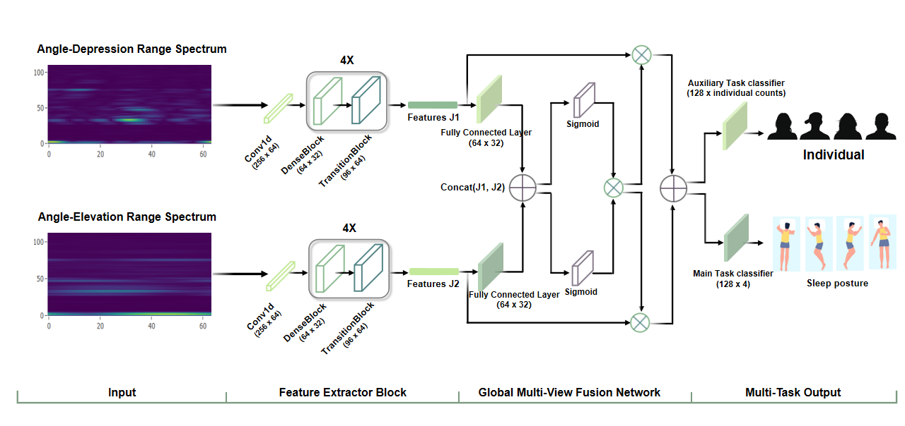
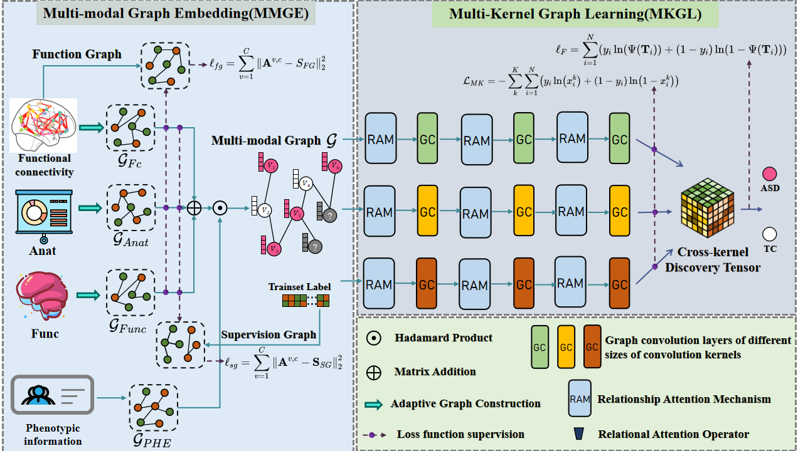
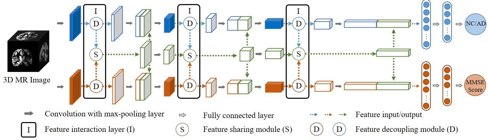
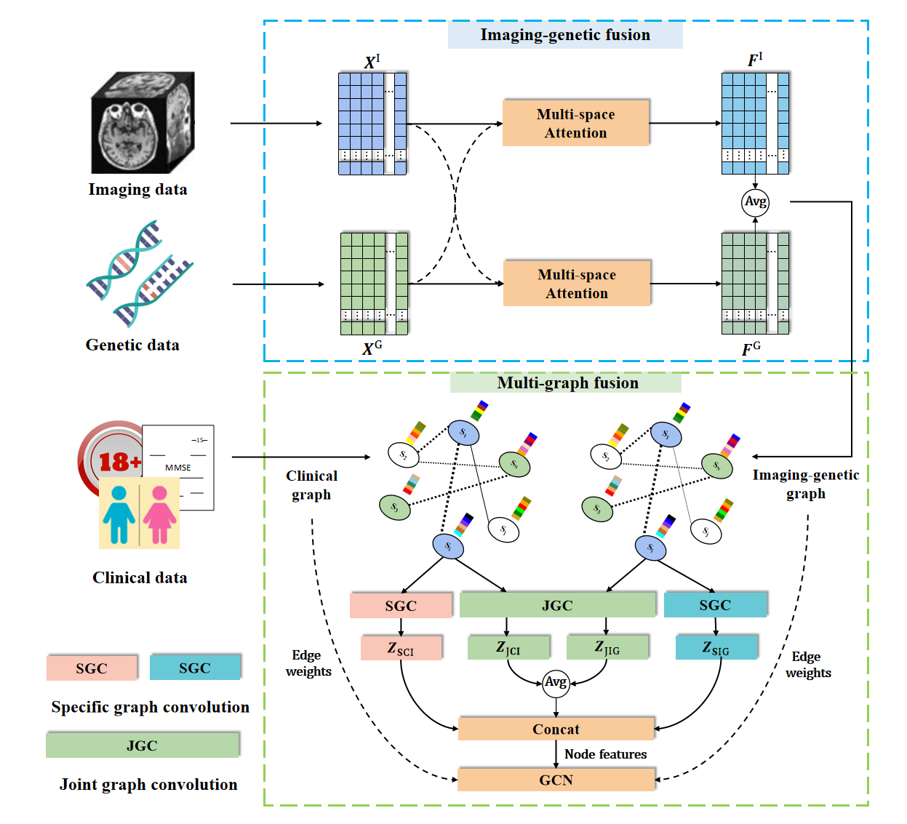
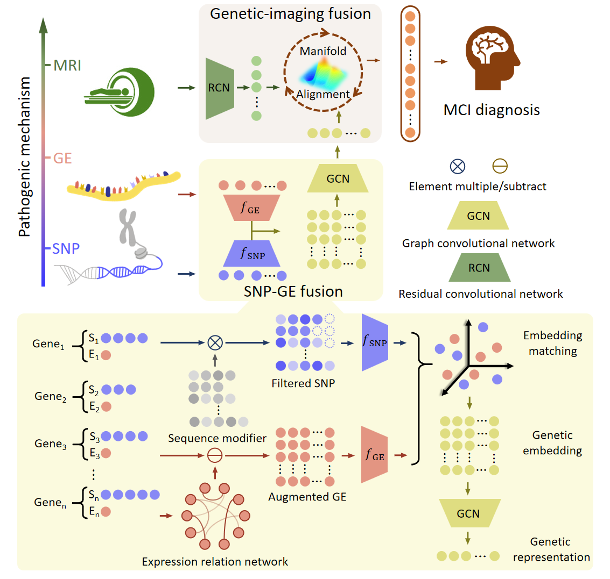

# 框架图展示

## 刘坤




## 毛浚彬



## 田旭


# Citation
```
@article{liu2024multi,
  title={Multi-Task Learning for Alzheimer's Disease Diagnosis and Mini-Mental State Examination Score Prediction},
  author={Liu, Jin and Tian, Xu and Lin, Hanhe and Li, Hong-Dong and Pan, Yi},
  journal={Big Data Mining and Analytics},
  volume={7},
  number={3},
  pages={828--842},
  year={2024},
  publisher={TUP}
}
```


## 田旭--TCBB



# Citation
```
@article{guo2023graph,
  title={Graph-based fusion of imaging, genetic and clinical data for degenerative disease diagnosis},
  author={Guo, Rui and Tian, Xu and Lin, Hanhe and McKenna, Stephen and Li, Hong-Dong and Guo, Fei and Liu, Jin},
  journal={IEEE/ACM Transactions on Computational Biology and Bioinformatics},
  year={2023},
  publisher={IEEE}
}
```

## 田旭--NN



# Citation
```
@article{peng2025fusion,
  title={Fusion of brain imaging genetic data for alzheimer’s disease diagnosis and causal factors identification using multi-stream attention mechanisms and graph convolutional networks},
  author={Peng, Wei and Ma, Yanhan and Li, Chunshan and Dai, Wei and Fu, Xiaodong and Liu, Li and Liu, Lijun and Liu, Jin},
  journal={Neural Networks},
  volume={184},
  pages={107020},
  year={2025},
  publisher={Elsevier}
}
```